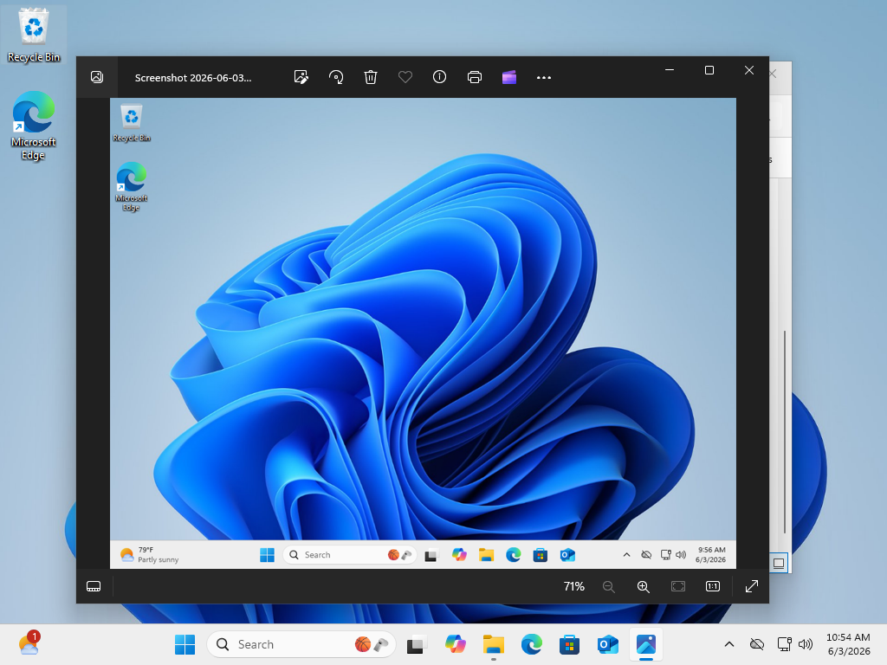
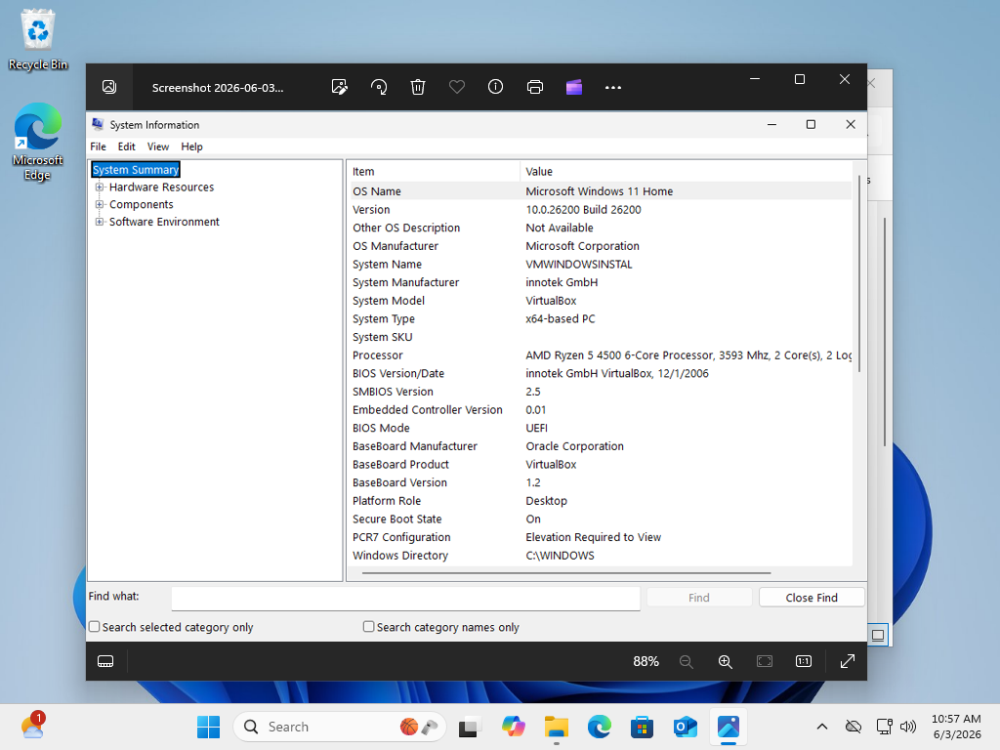
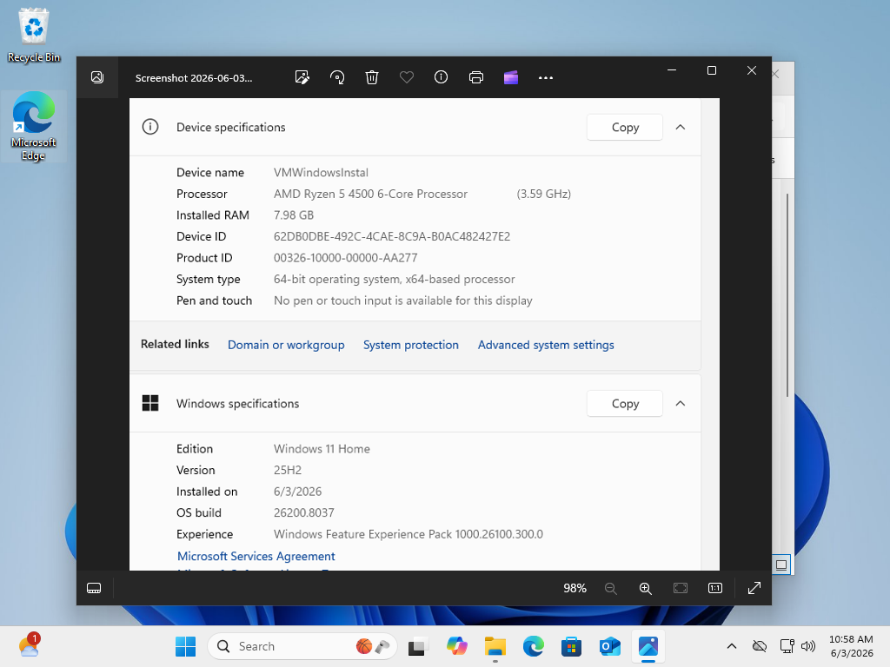
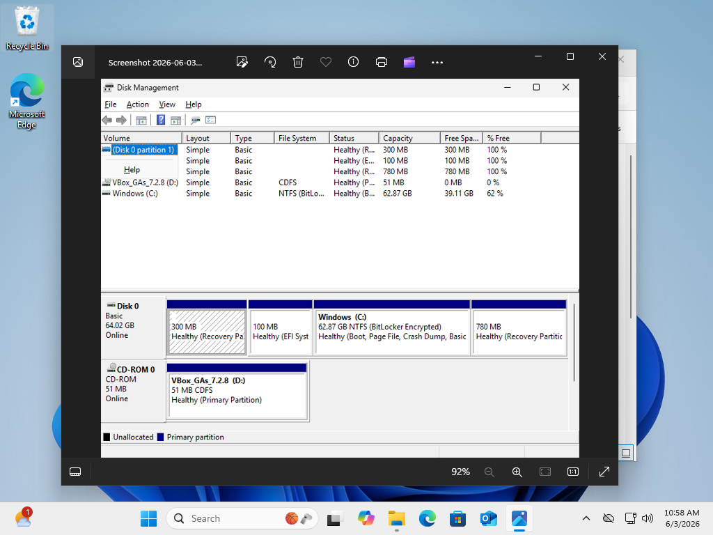
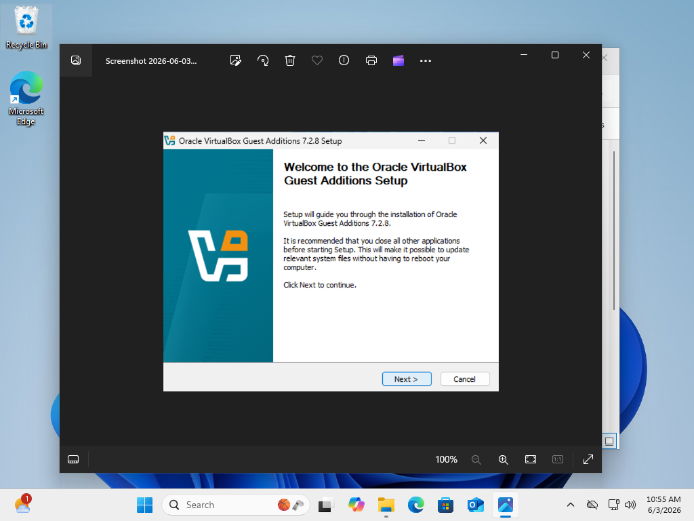
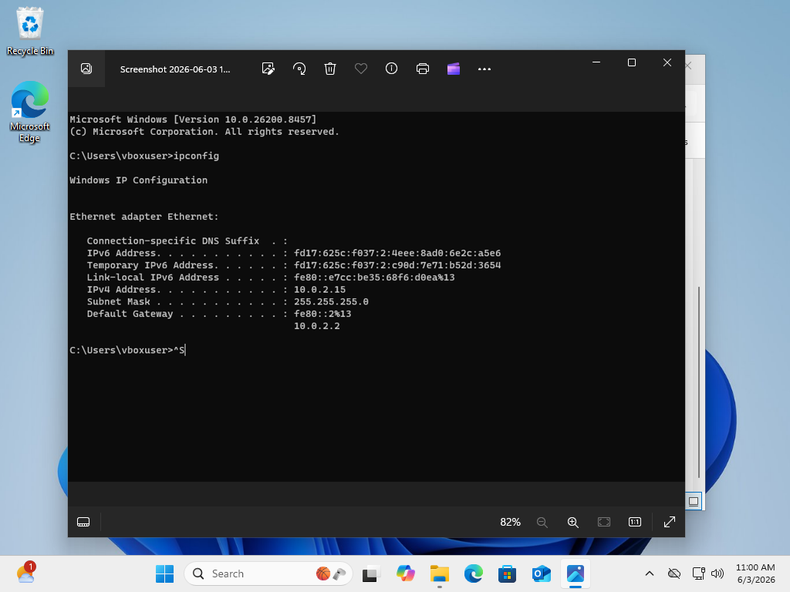

# Windows 11 VirtualBox Deployment Lab

## Project Overview

This project demonstrates the deployment and configuration of a Windows 11 virtual machine using Oracle VirtualBox.

The purpose of this lab was to gain hands-on experience with virtualization technologies, operating system deployment, system configuration, storage management, and network verification. This project simulates tasks commonly performed by Help Desk Technicians, Desktop Support Specialists, and System Administrators.

---

## Technologies Used

* Oracle VirtualBox
* Windows 11 Home
* VirtualBox Guest Additions
* Windows System Information
* Windows Disk Management
* Windows Command Prompt
* Virtual Networking

---

## Lab Objectives

* Create and configure a Windows 11 virtual machine
* Install Windows 11 using VirtualBox
* Verify system specifications and operating system details
* Configure virtual storage
* Install VirtualBox Guest Additions
* Verify network connectivity
* Document the deployment process

---

## Virtual Machine Deployment

### Windows 11 Desktop

Successfully installed and booted Windows 11 inside Oracle VirtualBox.



---

## System Verification

### System Information

Verified operating system information, hardware configuration, BIOS settings, and VirtualBox platform details.



### Device Specifications

Reviewed system specifications including processor, installed memory, operating system edition, and architecture.



---

## Storage Configuration

### Disk Management

Used Disk Management to verify disk partitions, storage allocation, and overall virtual disk configuration.



---

## VirtualBox Guest Additions

### Guest Additions Installation

Installed VirtualBox Guest Additions to improve:

* Display performance
* Screen resizing
* Mouse integration
* Clipboard sharing
* Overall virtual machine usability



---

## Network Configuration

### Network Connectivity Verification

Used Command Prompt to verify network connectivity and IP address assignment within the virtual machine.

```cmd
ipconfig
```

The system successfully received an IP address, subnet mask, and default gateway through the virtual network configuration.



---

## Skills Demonstrated

* Virtual Machine Deployment
* Windows 11 Installation
* Oracle VirtualBox Administration
* Operating System Configuration
* System Verification and Validation
* Storage Management
* Network Configuration
* Troubleshooting Fundamentals
* Technical Documentation

---

## Results

Successfully deployed and configured a Windows 11 virtual machine using Oracle VirtualBox.

The environment was validated by:

* Confirming successful Windows 11 installation
* Reviewing system specifications
* Verifying storage allocation
* Installing VirtualBox Guest Additions
* Confirming network connectivity
* Documenting the deployment process

This project demonstrates foundational virtualization and operating system administration skills that are relevant to Help Desk, Desktop Support, and System Administration roles.

---

## Key Takeaways

Through this lab I gained practical experience with:

* Virtual machine creation and deployment
* Operating system installation procedures
* Virtual hardware configuration
* Disk and partition management
* Guest Additions installation
* Network troubleshooting
* Technical documentation best practices

---

## Repository Structure

```text
Windows11-VirtualBox-Lab
│
├── README.md
│
└── Screenshots
    ├── 01-windows11-desktop.png
    ├── 02-system-information.png
    ├── 03-device-specifications.png
    ├── 04-disk-management.png
    ├── 05-guest-additions-installation.png
    └── 06-network-connectivity-ipconfig.png
```

---

## Author

**Dante Walker**

Aspiring IT Support / Help Desk Professional

GitHub Portfolio Project
